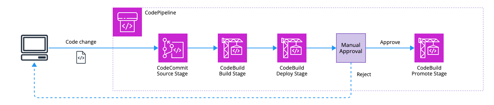
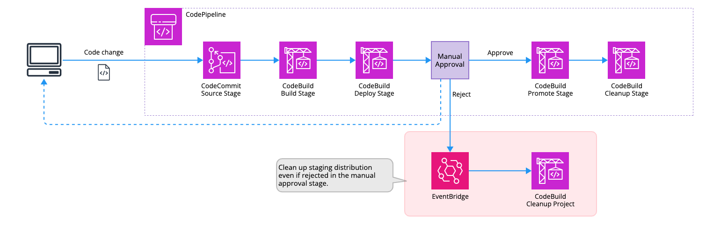

# cdk-cloudfront-deployment

This is a sample CDK application for running continuous CloudFront deployments with CodePipeline.

## Prerequisites

First, define the context as follows:

```json
{
  ...
  "context": {
    ...
    "owner": "user",
    "addresses": ["user@your-domain.jp"],
    "serviceName": "cfcd-test",
    "repositoryName": "test-repo",
    "branch": "main",
    "hostedZoneName": "your-domain.com",
    "webAclArn": "dummy-arn",
    "buildspecDir": "scripts/build",
    "cloudfrontConfig": {
      "singleHeaderConfig": {
        "header": "aws-cf-cd-staging",
        "value": true
      },
      "stagingDistributionCleanupEnabled": false
    }
  }
}
```

Next, place the version of the application front end in the SSM parameter store as follows:

```sh
$ aws ssm put-parameter --name "/<serviceName>/version/frontend" --value "v1" --type String --overwrite
{
    "Version": 1,
    "Tier": "Standard"
}
```

## Usage

The following command will launch a sample CloudFront distribution, hosting bucket, and pipeline for continuous deployment.

```sh
npx cdk synth --all
npx cdk deploy --all
```

## Pipeline actions

Pattern 1: Reuse staging distribution for each deployment without deleting it.



Pattern 2: Clean up staging distribution after each deployment.



## Todo

Since codebuild is used too much, we will consider how to make it more flexible by using AWS StepFunctions, etc.
